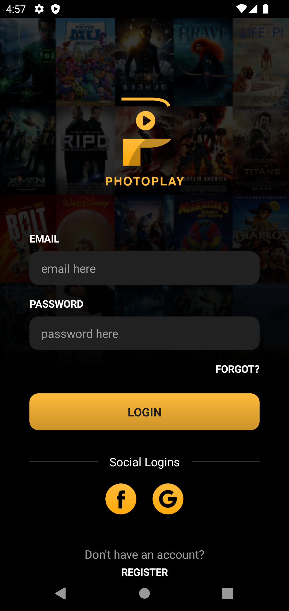
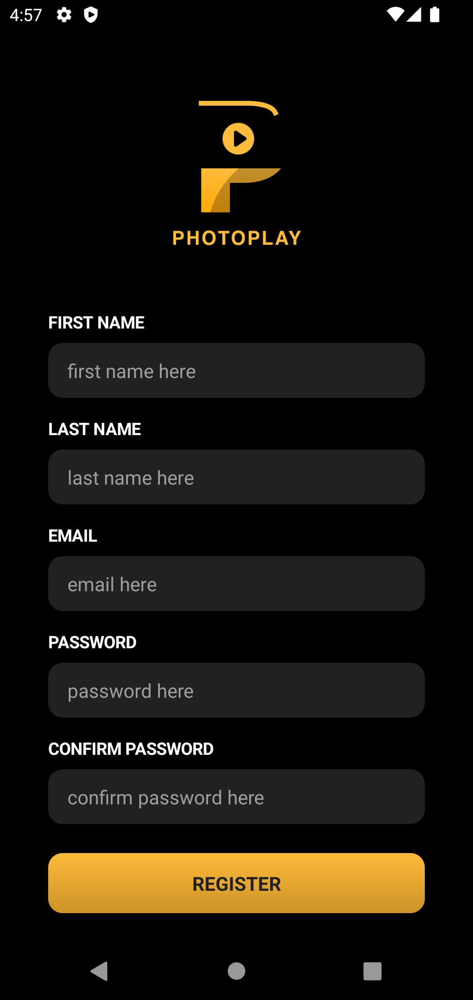
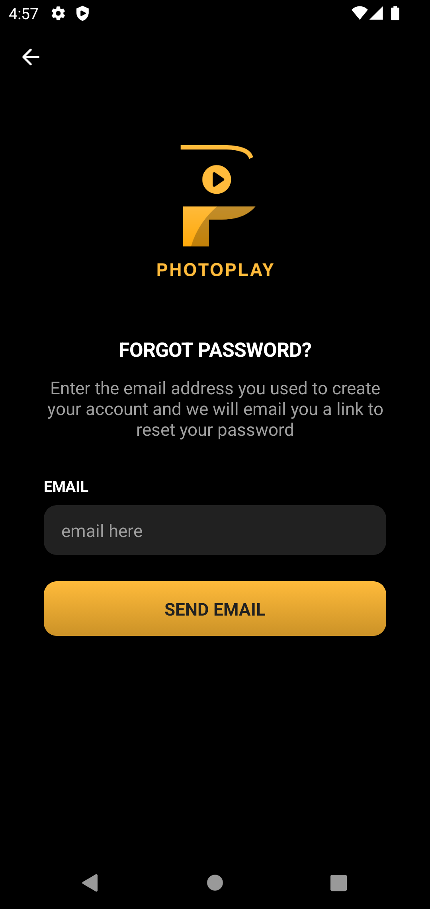
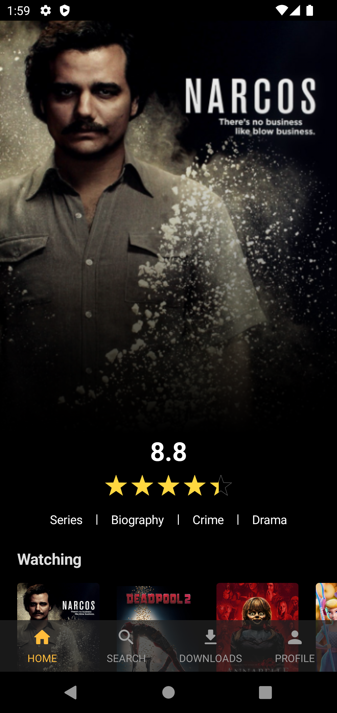
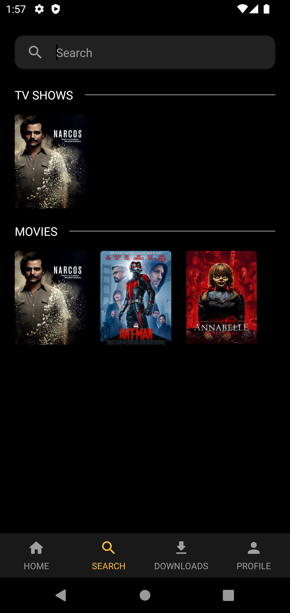
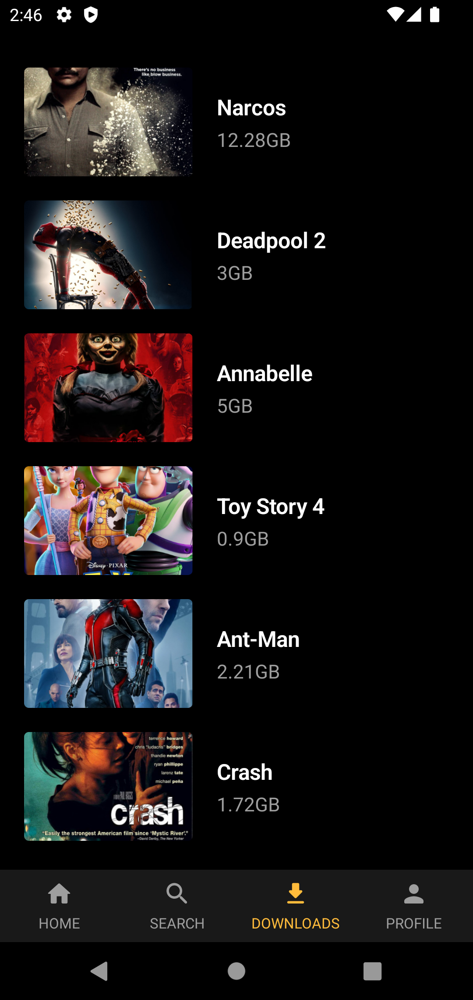
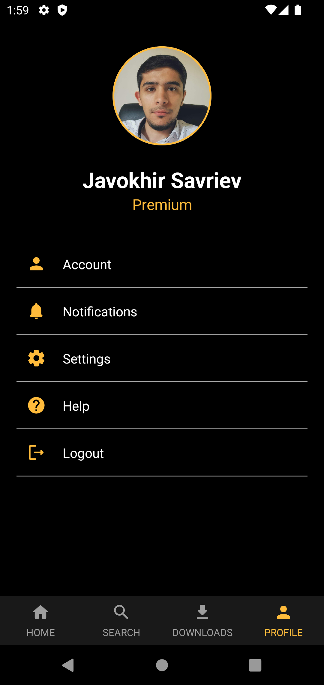
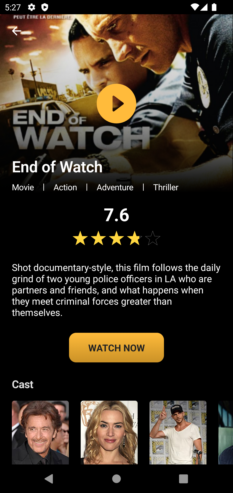
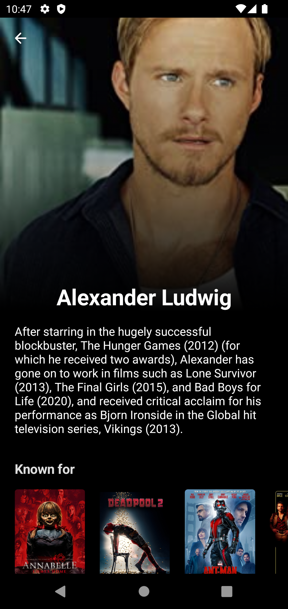

# **PhotoPlay**

A movie and TV Show streaming mobile app in Android built using Jetpack compose.

This project is developed by **Javokhir Savriev** for more projects [GitHub](https://github.com/javokhirsavriev/) .

## Application Install

***You can Install and test latest PhotoPlay app from below 👇***

## About

    

 

    
    
      
    
    

### This sample app showcases the following:

* Clean and Simple UI with Jetpack Compose
* Best and Clean Code Quality following Modern Android Development
* MVI Architecture (ViewModel + MutableState + StateFlow)
* Dagger Hilt for DI
* Compose BottomSheetScaffold
* Compose ConstraintLayout

## 📸 Screens

Login             |  Register | Forgot Password
:-------------------------:|:-------------------------: | :-------------------------: 
  |   | 

Home             |  Search | Downloads
:-------------------------:|:-------------------------: | :-------------------------: 
  |   | 

Profile             |  Movie details | Cast
:-------------------------:|:-------------------------: | :-------------------------: 
  |   | 

## Status: 🚧 In progress

PhotoPlay is still under development and more screens will be added.

## Built With 🛠

* [Jetpack Compose]
* [Accompanist]
* [DaggerHilt]
* [Coroutines]
* [Compose Navigation]
* [Coil]

[Jetpack Compose]: https://developer.android.com/jetpack/compose
[Accompanist]: https://github.com/chrisbanes/accompanist
[DaggerHilt]: https://developer.android.com/training/dependency-injection/hilt-android
[Coroutines]: https://developer.android.com/kotlin/coroutines
[Compose Navigation]: https://developer.android.com/jetpack/compose/navigation
[Coil]: https://coil-kt.github.io/coil/compose/

## If you like my projects you can buy me a cup of coffee

## Contact

You can connect with me here [LinkedIn](https://www.linkedin.com/in/sjavokhir/)